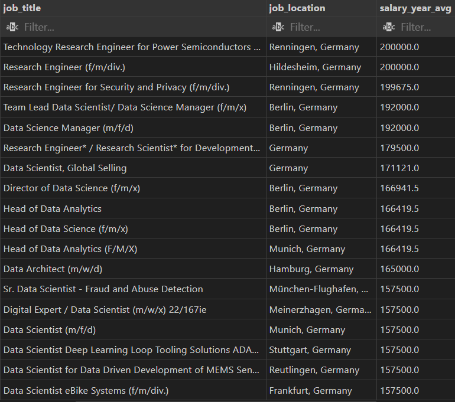
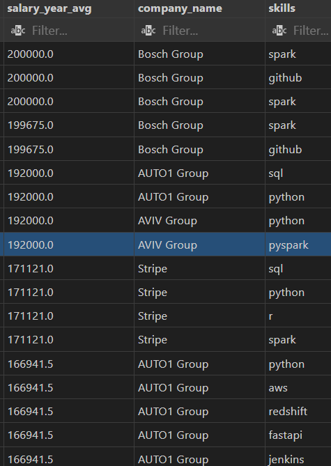
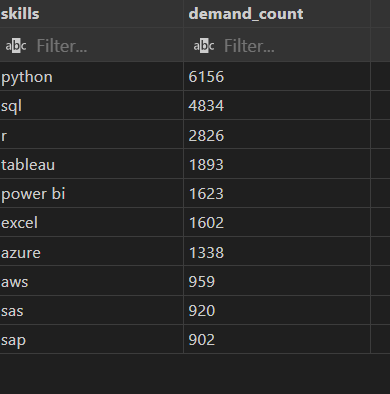

## INTRODUCTION


This focuses on data roles, this project explores 💰 top-paying jobs, in-demand skills, and where high demand meets high salary in data science and analytics.


## Tools I Used


SQL: allowing me to query the database and unearth critical insights.

PostgreSQL:ideal for handling the job posting data.

Visual Studio Code: My go-to for database management and executing SQL queries.

Git & GitHub: Essential for version control and sharing my SQL scripts and analysis

## The Analysis

Here is the link to the sql codes of the project [sql project](https://github.com/tegbetobi/SQL-for-Data_Analysis/tree/main/project_sql)

### 1. Top Paying Data Science and Analytics Jobs in Germany

```

SELECT	
	job_id,
	job_title,
	job_location,
	salary_year_avg,
	job_posted_date


FROM
    job_postings_fact

LEFT JOIN company_dim ON job_postings_fact.company_id = company_dim.company_id

WHERE
    (job_title_short = 'Data Scientist' OR job_title_short = 'Data Analyst') AND
    job_location LIKE '%Germany%' AND 
    salary_year_avg IS NOT NULL

ORDER BY
    salary_year_avg DESC

LIMIT 50;

```



### 2. Top Paying Skills in Data Analytics, scientist roles located in Germany


```
WITH top_paying_jobs AS (
    SELECT	
        job_id,
        job_title,
        salary_year_avg,
        name AS company_name
    FROM
        job_postings_fact
    LEFT JOIN company_dim ON job_postings_fact.company_id = company_dim.company_id
    WHERE
        (job_title_short = 'Data Scientist' OR job_title_short = 'Data Analyst') AND
        job_location LIKE '%Germany%' AND
        salary_year_avg IS NOT NULL
    ORDER BY
        salary_year_avg DESC

)

SELECT 
    top_paying_jobs.*,
    skills
FROM top_paying_jobs
INNER JOIN skills_job_dim ON top_paying_jobs.job_id = skills_job_dim.job_id
INNER JOIN skills_dim ON skills_job_dim.skill_id = skills_dim.skill_id
ORDER BY
    salary_year_avg DESC


LIMIT 50;

```



I can observe that spark, python, sql, github top the brackets in skilss.
I can also see that most of these jobs are offered by Bosch Group, AUTO1 Group, Stripe 


### 3. Top Demmanded Skills in Data Analyst, Scientist roles located in Germany


```

SELECT 
    skills,
    COUNT(skills_job_dim.job_id) AS demand_count

FROM job_postings_fact
INNER JOIN skills_job_dim ON job_postings_fact.job_id = skills_job_dim.job_id
INNER JOIN skills_dim ON skills_job_dim.skill_id = skills_dim.skill_id

WHERE
    (job_title_short = 'Data Scientist' OR job_title_short = 'Data Analyst')
    AND job_location LIKE '%Germany%'
GROUP BY
    skills
ORDER BY
    demand_count DESC
LIMIT 10;

```



Well seems like for anyone willing to work in any data analyst, scientist roles in Germany, he/she will need to perfect their python, sql, tableau skills


## WHAT I LEARNT

Complex Query Crafting: Mastered the art of advanced SQL, merging tables like a pro and wielding WITH clauses for ninja-level temp table maneuvers.

Data Aggregation: Got familiar with GROUP BY and turned aggregate functions like COUNT() and AVG() into my data-summarizing sidekicks.

Analytical Wizardry: Leveled up my real-world puzzle-solving skills, turning questions into actionable, insightful SQL queries.


## CONCLUSION

I would aim to improve on this by using visualizations 
